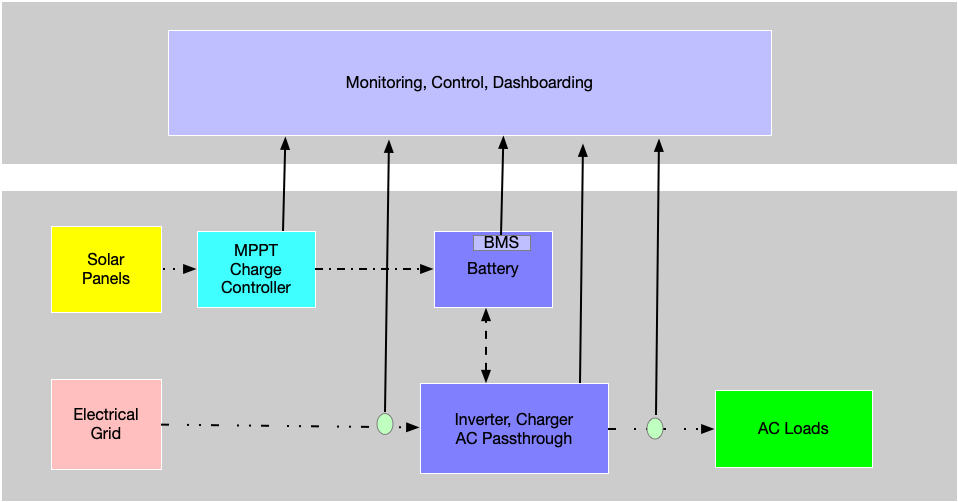
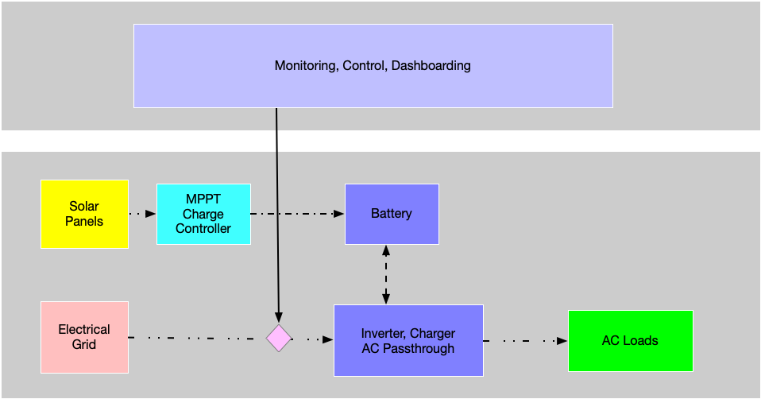

# Belenus 
Belenus (the celtic sun god)  provides a closed loop solar capture, solar time shifting, energy storage and un-interrupted run use case. 

## System Context

As shown in the context diagram, the system consists of a number of distinct components and interconnections. 
* Solar Panels capturing solar energy.
* Maximium Power Point Tracking(MPPT) Solar Charge Controller
* Lithium Iron Phosphate Battery and accompanying Battery Management System(BMS)
* Electrical Grid power 
* Inverter/Battery Charger/AC Passthrough
* AC loads comsuming power

The Solar Panels/Charge Controller harvests solar energy used to charge the battery or if the battery is a 100% state of charge, feeds the inverter to power the AC loads.

The AC passthrough function may (if Electrical grid power is availalbe) feed this power to the AC loads without using any of the stored battery power.

The AC charger function may ( if Electrical grid power is available) charge the battery. 

## Monitoring

A monitoring system captures telemery or measurements of power generation, usage and storage at various points in the system. These measurements are used to provide real time monitoring dashboards and also are an input into the control functionality of the system.
The monitoring capabilities include:
* Telemetry from the MPPT charge controller that provides solar power generation metrics.
* Data from the BMS, which provides battery characteristics such as charge/discharge state, state of charge, battery voltage, current sink or draw.
* Invertor/Charger/Passthrough operating metrics 
* Non invasive coil based measurement of AC circuits providing Voltage, Power, Frequency metrics.

## Control

Currently a single control point is provided in the form of an intelligent AC switch which allows for the engagement or disengagement of the Electrical grid power. With this switch it is possible to switch to using the stored battery power to feed the AC loads instead of the Grid power, this allowing for time shifting of power harvested either through solar capture or stored at a time of day with the cheaper time of day.
